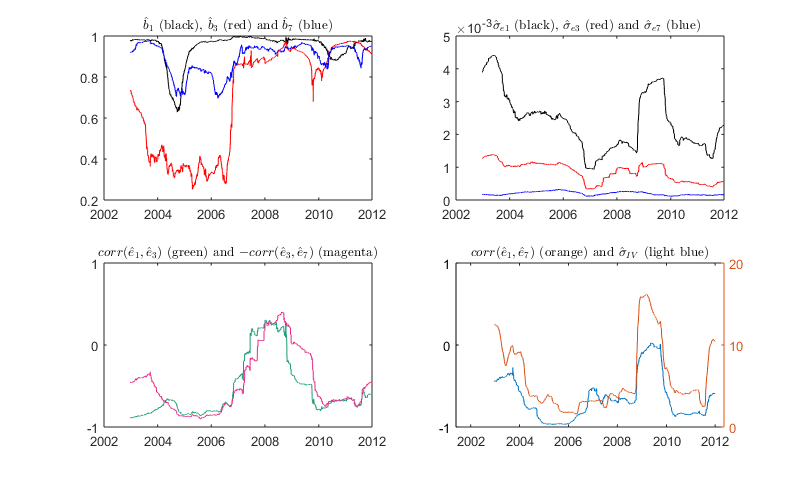

[](http://quantlet.de/index.php?p=info)

## [](http://quantlet.de/) **FPCAloadings** [](http://quantlet.de/d3/ia)

```yaml

Name of Quantlet : FPCAloadings

Published in : 'Functional Principal Component Analysis for Derivatives of High-Dimensional Spatial
Curves'

Description : 'Employs a moving window to estimate an AR(1) model for the loadings and to estimate
standard deviation of the VDAX, and plots the results.'

Keywords : 'estimation, FPCA, call prices, derivative, density, state price density, risk neutral
density, autoregressive, time series'

See also : 'FPCAgpu, FPCAepan, FPCAmultiloc, FPCAsimulate_input, FPCAindividual, FPCAvariance,
FPCAexpiration, FPCAcomponents, FPCAloadings'

Author : Maria Grith

Submitted : Maria Grith

Input: 
- Results.mat: Output of FPCAreal_data.m
- vdaxm.txt: VDAX index time series (same date as the loadings)
- xData.txt: date time series
- Is.txt: index for the time series of loadings
- tickdatayear.txt: tick years

Output: 
- b: autoregressive coefficients
- s: standard deviation of the error
- varcorr: pairwise error correlation
- volv: standard deviation of the VDAX index

```




### MATLAB Code:
```matlab
% clear variables and close windows
clear all;
close all;
clc;

%%% Start READ REAL DATA
load Results.mat % the workspace results are generated by the code FPCAreal_data.m
load('vdaxm.txt','-ascii')
load('xData.txt','-ascii');
load('Is.txt','-ascii');
load('tickdatayear.txt','-ascii');

%%% End READ REAL DATA

%%% Start PLOT FIGURE

% set size of the moving window
window=250;

% initiate container to store the results
b=[];
s=[];
error=[];
ASA=[];
varcorra=[];

% sort loadings
xx=-loadsb([1,3,7],Is)';

% compute time varying standard deviations and correlations using a moving window
for i=window+1:N-1
    for j=1:3
        x=xx(i-window:i,j);
        y=xx(i+1-window:i+1,j);
        mdl = fitlm(x,y,'y ~ x1 -1 ');
        R2ao(i)=mdl.Rsquared.Adjusted;
        COF=mdl.Coefficients.Estimate;
        ppv=mdl.Coefficients.pValue;
        b(i,j)=COF(1);
        error(:,j)=y-COF*x;
        s(i,j)=std(error(:,j)); % standard deviation
    end
    ASA=corr(error);
    varcorr(i-window,:)=[ASA(1,2) ASA(1,3) ASA(2,3)]; % pairwise correlation
end

figure(3)
hFig = figure(3);
set(hFig, 'Position', 0.8*[500 500 1000 600])
subplot(2,2,1)
plot(xData(window+1:N-1),b(window+1:N-1,1),'k-')
hold on
plot(xData(window+1:N-1),b(window+1:N-1,2),'r-')
hold on
plot(xData(window+1:N-1),b(window+1:N-1,3),'b-')
xlim([min(xData) max(xData)])
zh=title('$$\hat{b}_{1}$$ (black), $$\hat{b}_{3}$$ (red) and $$\hat{b}_{7}$$ (blue)')
set(zh,'Interpreter','latex')
set(gca,'XTick',tickdatayear([1,3,5,7,9,11]))
set(gca,'XTickLabel',[2002 2004  2006 2008 2010 2012])
set(gca, 'LooseInset', get(gca, 'TightInset'));
set(zh,'fontsize',10)
set(gca, 'fontsize',10)

subplot(2,2,2)
plot(xData(window+1:N-1),s(window+1:N-1,1),'k-')
hold on
plot(xData(window+1:N-1),s(window+1:N-1,2),'r-')
hold on
plot(xData(window+1:N-1),s(window+1:N-1,3),'b-')
xlim([min(xData) max(xData)])
zh=title('$$  \quad{ }  \hat{\sigma}_{e1}$$ (black), $$\hat{\sigma}_{e3}$$ (red) and $$\hat{\sigma}_{e7}$$ (blue)')
set(zh,'Interpreter','latex')
set(gca,'XTick',tickdatayear([1,3,5,7,9,11]))
set(gca,'XTickLabel',[2002 2004  2006 2008 2010 2012])
set(gca, 'LooseInset', get(gca, 'TightInset'));
set(zh,'fontsize',10)
set(gca, 'fontsize',10)

subplot(2,2,3)
% define brewer map colors
sig1col = [0.1059    0.6196    0.4667; 0.8510    0.3725    0.0078; 0.4588    0.4392    0.7020; 0.9059    0.1608    0.5412; 0.4000    0.6510    0.1176; 0.9020    0.6706    0.0078; 0.6510    0.4627    0.1137; 0.4000    0.4000    0.4000];
plot(xData(window+1:N-1),varcorr(:,1),'color',sig1col (1,:))
hold on
plot(xData(window+1:N-1),-varcorr(:,3),'color',sig1col (4,:))
xlim([min(xData) max(xData)])
zh=title('$$corr(\hat{e}_{1}, \hat{e}_{3})$$ (green) and $$-corr( \hat{e}_{3}, \hat{e}_{7})$$ (magenta)')
ylim([-1 1])
set(zh,'Interpreter','latex')
set(gca,'XTick',tickdatayear([1,3,5,7,9,11]))
set(gca,'XTickLabel',[2002 2004  2006 2008 2010 2012])
set(gca,'YTick',[-1 0 1])
set(gca, 'LooseInset', get(gca, 'TightInset'));
set(zh,'fontsize',10)
set(gca, 'fontsize',10)

subplot(2,2,4)
vda=vdaxm(Is)';
volv=[];
% compute the volatility of volatility index
for i=251:N-1
    volv(i)=std(vda(i-250:i));
end
[ax, h1, h2] = plotyy(xData(window+1:N-1),varcorr(:,2),xData(window+1:N-1),volv(window+1:N-1),'plot','plot','color', '#1f77b4','color', '#1f77b4');
zh=title('$$ corr(\hat{e}_{1}, \hat{e}_{7})$$ (orange) and $$\hat{\sigma}_{IV}$$ (light blue)')
set(zh,'Interpreter','latex')
set(gca,'XTick',tickdatayear([1,3,5,7,9,11]))
set(gca,'XTickLabel',[2002 2004  2006 2008 2010 2012])
set(zh,'fontsize',10)
set(gca, 'fontsize',10)
set(ax(1),'YColor',[0 0 0]);

%%% End PLOT FIGURE

```
